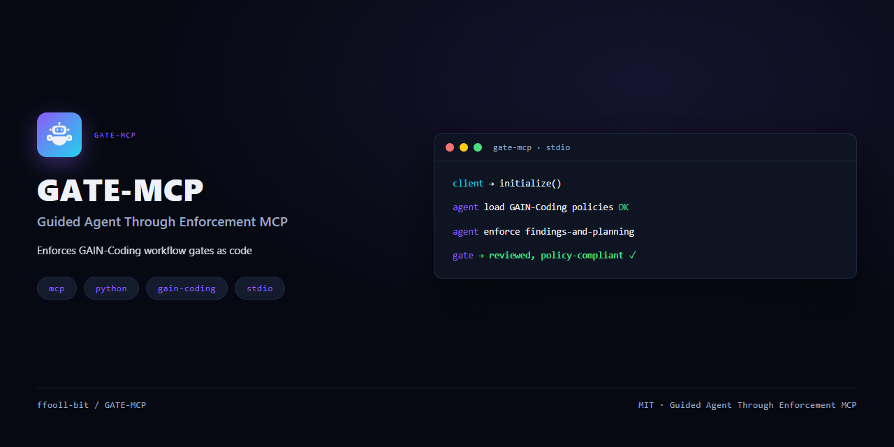

<div align="center">

# GATE-MCP



**Guided Agent Through Enforcement MCP** — an MCP server that enforces GAIN-Coding workflow gates as code.

</div>

GATE-MCP is an MCP (Model Context Protocol) server that enforces GAIN-Coding workflow gates as code — guiding the agent through reviewed, policy-compliant interactions and keeping it anchored in traditional engineering discipline. It is the active, machine-driven companion to GAIN-Coding: where GAIN-Coding is the canonical workflow specification written for the agent to read through progressive context loading, GATE-MCP holds its own machine-oriented spec (YAML per workflow) that mirrors the GAIN-Coding document structure, and does not parse that markdown at runtime.

## Name

`GATE` stands for **G**uided **A**gent **T**hrough **E**nforcement. The full expansion is *Guided Agent Through Enforcement MCP*. (When the expanded GATE is written out, `MCP` stays unexpanded — "Enforcement Model Context Protocol" is never used.)

## Features

- Enforces GAIN-Coding workflow gates as code, keeping agent interactions reviewed and policy-compliant.
- Holds machine-oriented YAML specs (one per workflow and per policy) that mirror the GAIN-Coding document structure.
- Runs as a stdio MCP server using the official `mcp` SDK, with a single runtime dependency.
- First implementation is a vertical slice covering the `findings-and-planning` workflow plus an integrated `docs/IMPROVEMENTS.md` tracker validator; the remaining workflows are added in later sessions (YAGNI).

## Installation

```bash
pip install .
```

## Usage

Register GATE-MCP with your MCP client, or run it directly over stdio:

```bash
gate-mcp
```

Both the `gate-mcp` console script and `python -m gate_mcp` start the server over stdio.

### Standalone vs. repo-checkout operation

The workflow specs live in the repository (`specs/`), not inside the installed wheel, and the tracker (`docs/IMPROVEMENTS.md`) is a working document that mutates as items pass through the gates. For the tools to resolve the specs and tracker, run the server from a GATE-MCP repo checkout (editable install), or point a standalone installation at a checkout by setting `GATE_MCP_REPO` to that checkout's root:

```bash
GATE_MCP_REPO=/path/to/gate-mcp gate-mcp
```

Without a repo checkout or `GATE_MCP_REPO`, a standalone `pip install` can start the server and list the tools, but the workflow tools will fail to locate the specs and tracker.

### Known limitation: Windows stdio first response

On Windows with Python 3.13, the first MCP tool call immediately after `initialize()` over stdio can intermittently return an empty content node. This is a transport framing characteristic of the MCP SDK on the Windows Proactor event loop, not a server logic defect. The server now installs the Selector event loop on Windows (`WindowsSelectorEventLoopPolicy`) to avoid that scheduling path, which reduces the likelihood, but does not guarantee it can never occur.

Third-party MCP client authors should tolerate an empty first response and retry:

```python
async def call_with_retry(session, name, arguments, retries=3, delay=0.3):
    for attempt in range(retries):
        result = await session.call_tool(name, arguments)
        text = result.content[0].text if result.content else ""
        if text:
            return result
        await asyncio.sleep(delay)
    return result
```

## Documentation

- [CHANGELOG.md](CHANGELOG.md) — release history
- [CONTRIBUTING.md](CONTRIBUTING.md) — how to contribute
- [CODE_OF_CONDUCT.md](CODE_OF_CONDUCT.md) — community standards
- [SECURITY.md](SECURITY.md) — security policy

## License

MIT. See [LICENSE](LICENSE).
